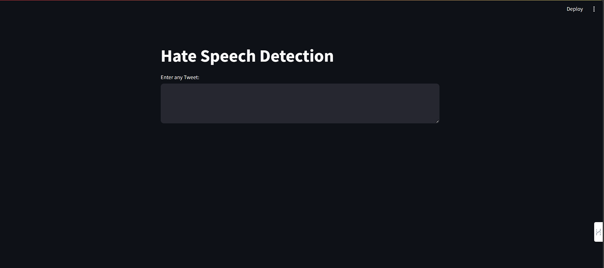

# Hate Speech Detection using Decision Trees

This repository contains code for detecting hate speech in tweets using a decision tree classifier. The model is trained on a dataset of labeled tweets and can predict whether a given tweet falls into one of three categories: "Hate Speech," "Offensive Language," or "No Hate and Offensive."

## Prerequisites

Before running the code, ensure you have the following installed:

- Python 3.9
- `nltk` library
- `pandas`
- `numpy`
- `scikit-learn`

## Usage

1. **Data Preparation**:
   - The dataset is loaded from a CSV file named `twitter.csv`.
   - The `class` column is mapped to human-readable labels: 0 (Hate Speech), 1 (Offensive Language), and 2 (No Hate and Offensive).
   - The relevant columns are extracted: `tweet` (text) and `labels`.

2. **Text Preprocessing**:
   - The `clean` function performs the following preprocessing steps:
     - Converts text to lowercase.
     - Removes URLs, special characters, and digits.
     - Tokenizes the text.
     - Removes stopwords.
     - Applies stemming using the Snowball stemmer.

3. **Feature Extraction**:
   - The `CountVectorizer` is used to convert the preprocessed tweet text into a bag-of-words representation.

4. **Model Training and Evaluation**:
   - The dataset is split into training and testing sets.
   - A decision tree classifier (`DecisionTreeClassifier`) is trained on the training data.
   - The model's accuracy is evaluated on the testing data.

5. **Hate Speech Detection Web App**:
   - The `app.py` file creates a Streamlit web app.
   - Users can input a tweet, and the model predicts whether it contains hate speech, offensive language, or neither.

## How to Run

1. Install the required libraries:
   ```bash
   pip install nltk pandas numpy scikit-learn streamlit
   ```

2. Run the Streamlit app:
   ```bash
   streamlit run app.py
   ```

## Example



---

Feel free to customize this README with additional information about your project. If you have any questions or need further assistance, feel free to ask! 🚀
